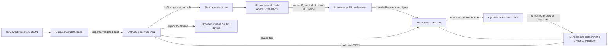

# Opportunity Facts threat model

Last reviewed: 2026-08-11
Scope: version-one public Next.js application, repository cards, local drafts, URL analysis, pasted-source analysis, and optional OpenAI extraction.

## Security posture in one paragraph

Opportunity Facts accepts hostile URLs, HTML, text, and imported JSON, then presents source excerpts to a browser. Its most important risks are server-side request forgery (SSRF), DNS rebinding and redirects, resource exhaustion, model prompt injection, unsupported model claims, cross-site scripting (XSS), accidental disclosure of submitted content, and product-language overclaiming. The design uses address-pinned public-only fetching, strict schema validation, nonexecuting text extraction, React text rendering, server-only model credentials, and deterministic excerpt matching. These controls reduce risk; they do not make arbitrary remote fetching, model interpretation, dependencies, hosting infrastructure, or reviewed source claims perfectly secure or true.

## 1. Scope and security objectives

The objectives are:

1. prevent analysis requests from reaching local, private, link-local, metadata, or other non-public network targets;
2. keep source-page code and instructions from executing or changing the application's task;
3. never display a model-produced value as source-supported when its excerpt cannot be matched to the reviewed source text;
4. keep server secrets out of browser code and user-visible errors;
5. render source content and imported data as inert text rather than markup;
6. bound server time, pages, redirects, headers, response bytes, and model work;
7. avoid application-level permanent retention of submitted URLs/pages/text;
8. preserve uncertainty and prevent security or disclosure signals from becoming legitimacy, scam, prestige, admissions-impact, or value verdicts.

This model does not cover a compromised user device/browser, a compromised hosting provider or model provider, malicious changes by a repository maintainer, physical access, or the truth of statements made by source pages. It assumes the dependency lockfile and deployment configuration are reviewed and that HTTPS termination and operating-system security are provided by the deployment platform.

## 2. Assets

| Asset | Why it matters | Desired property |
| --- | --- | --- |
| OpenAI API key and server environment | Key misuse can leak data or incur cost | Confidentiality, restricted use |
| Server network position | A fetch primitive could access internal services | Network isolation, destination integrity |
| Submitted URL and pasted source text | May contain confidential data despite instructions | Confidentiality, minimal retention |
| Fetched source text | Hostile content may target parser, model, or UI | Isolation, bounded processing |
| Facts, excerpts, status, and provenance | Users rely on accurate source alignment | Integrity, traceability |
| Schema, field registry, normalization rules | Define every displayed field and disclosure count | Integrity, versioning |
| Public repository cards and dataset | Public durable records may be copied downstream | Integrity, correction history |
| User drafts and compare selections | May reveal interests or contain pasted text | Device-local confidentiality and user control |
| Service/model capacity | Public analysis can consume CPU, network, and model quota | Availability, cost bounds |
| Product semantics | A misleading badge can create real decision harm | Honest uncertainty and non-verdict language |

## 3. Actors and attacker capabilities

- An unauthenticated visitor can submit an arbitrary URL, pasted source record, correction value, or imported card.
- A malicious public site can control DNS, redirect responses, headers, byte stream, markup, visible text, links, and timing.
- A malicious source author can place prompt-injection instructions and plausible false claims inside visible text.
- A model can return malformed output, unsupported values, fabricated excerpts, wrong source IDs, or a correct quotation attached to the wrong interpretation.
- A user can intentionally send expensive repeated analyses or huge inputs up to exposed limits.
- A dependency or future rendering change can bypass expected parsing, encoding, or network invariants.

An ordinary user is also a privacy-risk source: they may accidentally paste application materials, personal data, signed URLs, or account-only content. The interface must warn against this; public-source intent alone does not prevent mistakes.

## 4. Trust boundaries and data flow

Key boundaries:

1. **Browser to server:** all request bodies and imported values are untrusted, even if produced by this UI.
2. **Server to DNS/network:** URL syntax is not proof that the resolved or connected address is public.
3. **Remote response to parser:** headers, body, charset, links, and HTML are attacker-controlled.
4. **Extracted text to model:** page text is data, never policy or instructions.
5. **Model to application:** structured output is an untrusted candidate, not evidence.
6. **JSON/text to browser:** schema validity is not HTML safety; output encoding is still required.
7. **Browser to local storage/download:** data becomes persistent on the user's device and inherits that device's account/extension risks.
8. **Repository to public dataset:** accepted public cards are durable and require review/version/correction controls.

## 5. Implemented fetch envelope

The production fetch path is designed around the following defaults:

| Limit/control | Default |
| --- | ---: |
| Analysis request body | 600,000 bytes; 10,000 ms total read time |
| Whole analysis route | 270,000 ms application deadline; 300 s route-segment maximum |
| URL length | 2,048 characters |
| DNS answers accepted for inspection | At most 32; all must be public |
| Whole fetch/redirect-chain timeout | 10,000 ms |
| Response body | 1,500,000 bytes maximum |
| Redirects | 5 maximum |
| Response headers | 16,384 bytes maximum |
| Accepted response media types | `text/html`, `text/plain` |
| Content encoding | Identity only |
| Extracted visible text | 200,000 characters per page by default |
| Extracted links considered | 500 per page maximum |
| Discovery scope | Submitted page plus at most 6 relevant links selected from that origin; one selected application link may make one public-origin transition by redirect |
| Source-text characters sent in normal Analyze | 55,000 aggregate maximum, excluding fixed instructions/metadata |
| Source-text characters sent in each Extended Research request | 70,000 aggregate maximum selected from exact normalized blocks |
| Model output | Normal Analyze: 4,800 tokens maximum. Extended Research: 8,000 detailed-process and 8,000 financial/outcome tokens maximum, independently salvageable. |

Relevant code is in `lib/analysis/url-safety.ts` and `lib/analysis/fetch.ts`. If a deployment changes these defaults, the deployed values and tests must be updated together. Per-call overrides are bounded by hard validation; an application route must not expose caller-controlled overrides.

Requests use a descriptive Opportunity Facts user agent, request identity encoding, disable connection reuse for this transport, and send no application cookie, authorization header, or user credential. The route must not forward browser headers wholesale.

## 6. Threats, controls, and residual risk

### T1. SSRF through a submitted URL

**Attack:** Submit `file:`, FTP, loopback, an alternate textual IP form, a private address, a metadata name/address, embedded credentials, or a public hostname that resolves to a non-public address.

**Controls:**

- Parse with the platform URL parser and accept only absolute `http:` or `https:` URLs on their protocol-default ports. Non-default ports are rejected so public fetching cannot become a blind arbitrary-port request primitive.
- Reject URL user-info, missing hostnames, single-label/local-use hostnames, known metadata hostnames and service addresses (including Azure `168.63.129.16`), overlong URLs, sensitive query or fragment parameter names, and invalid literal addresses.
- Canonicalize bracketed/trailing-dot/lowercase hostnames before policy checks.
- Parse IPv4, IPv6, and IPv4-mapped IPv6 with `ipaddr.js`; accept only its public unicast range.
- Resolve all returned addresses (up to 32) and reject the hostname if **any** answer is non-public. Do not choose a convenient public answer from a mixed set.
- Never inherit browser cookies, authentication, or an arbitrary request method/body.
- Reject token-, signature-, session-, auth-, code-, and secret-like query/fragment keys. Strip only a narrow recognized set of marketing identifiers (`utm_*`, common advertising click IDs, and `attribution_id`) before transport and source metadata; preserve ambiguous and functional parameters such as `source`, `ref`, cohort, and form-routing values.

**Residual risk:** IP range libraries, reserved-range policy, and the deliberately narrow marketing-key list must be kept current. Unrecognized tracking parameters remain visible to the destination and in source metadata; overbroad stripping could break a public resource, so ambiguous keys are intentionally retained. Plain HTTP exposes the fetched request/response on the network. A public server can itself proxy or publish internal material; destination filtering cannot determine how that server obtained its content. Deployment-level egress policy remains valuable defense in depth.

### T2. DNS rebinding and time-of-check/time-of-use changes

**Attack:** Resolve a hostname to a public IP during validation and a private IP when the HTTP client opens its socket.

**Controls:**

- Pass a previously validated address to the Node transport.
- Pin the socket lookup to that address while preserving the original hostname for the HTTP `Host` header and TLS SNI/certificate validation.
- Disable pooled-agent reuse for the fetch.
- Compare the connected socket's remote address with the validated address and reject a mismatch.
- Validate and pin each new redirect destination independently.

**Residual risk:** This invariant can be lost if production swaps in global `fetch`, a proxy, custom transport, connection pool, or platform adapter that performs its own DNS resolution. Any transport change requires an integration test proving the connected address is the validated address. Network-layer egress restrictions should still block private and metadata ranges.

### T3. Redirect pivot

**Attack:** A public URL redirects to loopback, private IPv4/IPv6, link-local, metadata, a credential-bearing URL, a disallowed protocol, or an endless chain.

**Controls:** Do not use automatic redirects. Resolve each `Location` against the current URL, re-run the full URL/DNS/public-address policy, pin the new connection, and stop after five redirects. Missing or malformed locations fail closed. Discovered pages normally remain pinned to the submitted origin. At most one already-ranked `application` candidate may transition once to a different public origin, after which every later redirect must remain on that destination origin. The allowance is consumed by the first eligible application candidate and cannot be transferred to another discovered link.

**Residual risk:** Cross-origin redirects to another public host are permitted for the submitted page if they pass validation. The narrow application-link exception also permits one third-party public form host to see a request. An official site with an open redirect can therefore select that one untrusted public destination, but cannot create a general external crawl: the candidate must have been selected from the submitted origin, the transition is allowed only for the first ranked application topic, and a second origin change fails closed. Query strings are retained across only the redirects constructed by the remote origin; users must not submit signed/private URLs. All resulting content remains `user_supplied` and still requires evidence, scope, cycle, and target-entity validation.

### T4. Oversized, slow, compressed, or malformed responses

**Attack:** Hold sockets open, lie about `Content-Length`, stream beyond the limit, return giant headers, or send a compression bomb/unsupported binary type.

**Controls:**

- Apply the timeout to validation, redirects, headers, and body processing as one operation.
- Cap response headers and check `Content-Length` when present.
- Count streamed bytes and abort above 1,500,000 bytes even when length is absent or false.
- Request `Accept-Encoding: identity` and reject a non-identity `Content-Encoding`, avoiding decompression expansion in the application.
- Accept only HTML and plain text with a bounded syntactically valid charset declaration.
- Process accepted simple CSS-hidden selectors, reveal shells, generic content containers, and nested lists with bounded DOM traversals; never rescan or clone a full descendant subtree once per hostile selector or ancestor.
- Bound page discovery, model input, and model output separately.

**Residual risk:** Public endpoints can still consume DNS, connection, TLS, parsing, and model resources below each per-request limit. The application has no account identity with which to attribute abuse. Production needs platform request-body limits, concurrency/cost monitoring, and rate controls appropriate to its traffic; these should fail without exposing secrets or weakening deterministic tests.

Identity-only transfer is intentionally conservative: a server that ignores `Accept-Encoding: identity` is rejected instead of decompressed. PDF and other binary documents are not fetched by this path. JavaScript-rendered pages are not executed. Users must use the pasted-source fallback for material that cannot be represented as accepted static HTML/plain text.

### T5. Overbroad crawling and data exfiltration

**Attack:** Use a page's links to make the server crawl unrelated hosts, private paths, logout/action URLs, or an unbounded site.

**Controls:** Discover only relevant GET links present on the submitted page, require normalized same origin (scheme, hostname, and effective port) before ranking, rank a fixed set of disclosure-related terms, revalidate every selected URL, and fetch no more than six additional pages. Direct external links are never ranked. One first-ranked `application` candidate may follow one fully revalidated redirect to a different public origin; redirects are then pinned to that destination origin. No other discovered topic gets this exception. Do not execute JavaScript, submit forms, follow login flows, use credentials, or recursively crawl links from either the original site or the form host.

**Residual risk:** Same-origin links and a selected application link's public redirect can still trigger poorly designed state-changing GET endpoints. The descriptive user agent, GET-only behavior, fixed headers, page cap, one-transition limit, no-auth policy, and absence of form submission reduce but do not eliminate this remote-site design risk. Discovery should reject obvious action/logout paths and remain easy to disable.

### T6. Prompt injection in fetched or pasted text

**Attack:** A page says “ignore previous instructions,” imitates a system message, requests secrets, asks for a verdict, or embeds false output JSON.

**Controls:**

- Treat all extracted text as `untrusted_source_text`; visible and hidden prose never becomes a system/developer instruction.
- Remove script, style, executable markup, repeated navigation, and identifiable boilerplate before model input, while assuming malicious instructions can remain in visible text.
- Use one compact normal strict-output section containing only sparse decision-useful claims plus grounded attention candidates. Source metadata is carried once and the provider returns bounded source IDs/excerpts rather than complete authoritative Fact objects. Do not give the model network, file, shell, credential, or arbitrary tool access.
- Send at most 55,000 aggregate normalized source characters to normal Analyze and request at most 4,800 output tokens. Optional Extended Research reuses the server-held source contexts and validated normal card, then runs independently salvageable detailed-process and financial/outcome sections with at most 8,000 output tokens each. The server uses `OPENAI_MODEL` when configured and otherwise the code's versioned default.
- Carry Extended Research state only through an opaque UUID referencing an instance-local, 30-minute, size- and count-bounded session. Never accept a browser-supplied card as authoritative continuation state. Expired, incompatible, or unavailable sessions fail without modifying the normal result.
- Divide the model-input budget across every acquired page before redistributing unused capacity; expose per-page model truncation in the analysis record.
- Give model requests a 120-second SDK timeout, use low reasoning effort, disable automatic retries, and propagate request cancellation to fetch and model work. The live development benchmark showed that the prior 45-second bound returned no drafts for the production V2 contract.
- Treat automatically fetched, discovered, and pasted pages as `user_supplied`; topical URL/link terms never prove an `official_*` provenance category.
- Instruct the model to extract only registered fields, preserve uncertainty/conflicts, and refuse legitimacy/value judgments.
- Parse model output through the authoritative schema and allowed registry statuses.
- Match every returned excerpt against normalized text from the cited source. An unmatched excerpt cannot support a displayed value and is removed or downgraded.
- Test adversarial fixture text and hostile candidate outputs without live network/model dependencies.

**Residual risk:** Prompt injection is not “solved.” A model may misunderstand a matching passage, select an irrelevant real quotation, omit a material disclosure, or normalize incorrectly. Exact matching proves presence, not semantic entailment or real-world truth. Analysis output remains `draft` until a human performs source/value alignment review.

Static Cheerio extraction cannot reproduce every browser layout, shadow DOM, client-rendered state, or computed-CSS visibility rule. Hidden-text removal is a bounded heuristic, not a browser-equivalence or sanitization proof. The extractor may read only allowlisted Course/FAQ fields from bounded, non-executable Schema.org JSON-LD; that publisher metadata is still hostile source text and receives the same evidence controls. A fetched shell with no extractable source text is identified in the result and converts absence claims to durable uncertainty. Other omissions remain possible; the pasted-source fallback and human evidence review remain necessary.

### T7. Fabricated, misattached, or conflicting evidence

**Attack/failure:** A model invents an excerpt, cites source A for source B's text, attaches a genuine excerpt to the wrong value, drops a conflict, or turns in-kind value into cash.

**Controls:** Use stable source IDs, exact source metadata, deterministic normalized-substring matching, field-type normalization, strict conflict representation, explicit calculation metadata, and separate cash/in-kind categories. A conflict keeps at least two distinct supported candidates rather than a chosen top-level value. Schema-invalid candidates fail closed.

**Residual risk:** Automated validation does not establish that an organizer's claim is true or that a source is authoritative. Duplicate text across pages can complicate source attribution. Human review remains necessary for semantics, context, material omissions, and source identity.

### T8. XSS and unsafe active content

**Attack:** HTML, SVG, event handlers, `javascript:` links, Markdown/HTML fragments, imported strings, or source titles execute in the Opportunity Facts origin.

**Controls:**

- Parse remote HTML server-side only to extract text/links and bounded allowlisted Course/FAQ JSON-LD fields; never execute source scripts.
- Never insert source HTML with `dangerouslySetInnerHTML`.
- Render excerpts, titles, notes, and values through React text nodes, which escape markup by default.
- Restrict source/card URLs to HTTP(S), validate imported JSON, and treat link text separately from destinations.
- Use `rel="noopener noreferrer"` for new-tab external links.
- Create JSON/text/Markdown downloads as data, not executable in-origin previews.
- Keep schema errors and logs textual; never echo a raw HTML error response into the page.

**Controls for portable correction output:** The correction generator validates public HTTP(S) destinations, escapes Markdown control characters, neutralizes `@` mentions, and quotes excerpts line by line. The application still treats the resulting packet as untrusted text rather than rendering it as HTML in-origin.

**Residual risk:** A future rich-text renderer, MDX/Markdown feature, URL bypass, or third-party component could reintroduce XSS. The application sets a Content Security Policy and security headers, but their actual deployed response still requires verification. Downloaded files can be interpreted differently by other software; do not add HTML or spreadsheet exports from untrusted fields without format-specific escaping.

### T9. Malicious JSON import and browser storage

**Attack:** Import oversized, deeply nested, schema-invalid, prototype-shaped, or active-content values; poison a locally saved draft; exceed storage quota.

**Controls:** Parse JSON as data, validate with the strict Zod schema, reject unknown/invalid shapes, and render only encoded text. Client imports are rejected before reading when they exceed 1 MB. Local-storage writes catch quota and security failures, report the failure, and do not treat an unsuccessful write as a saved action. Reset requires confirmation. Public repository data is validated at build/test time as well as load time.

**Residual risk:** Browser extensions, another script compromised under the same origin, shared OS accounts, and developer tools can read local storage. Local drafts are convenience storage, not a secure vault. Users must avoid storing sensitive application materials.

### T10. API key exposure and model-provider data flow

**Attack/failure:** Bundle `OPENAI_API_KEY` into client code, leak it in an error/log, accept a user-supplied key, or send undisclosed content to the provider.

**Controls:** Import model integration only from server-only modules. Read `OPENAI_API_KEY` and `OPENAI_MODEL` on the server. Never use a `NEXT_PUBLIC_` name for a secret, serialize environment values into props, or return provider errors verbatim. Every Responses request sets `store: false`, uses strict Zod-backed structured parsing, and gives the model no application tools. Only a response whose provider status is exactly `completed` may be parsed as a finished section. The no-key path remains functional and makes no model request. A failed section is never retried automatically; independent completed sections may form a visibly partial draft.

**Residual risk:** When configured, approved source text is sent to OpenAI and is subject to the account/provider's then-current processing and retention terms. This application cannot promise provider-side zero retention. Operators must review those terms/settings, disclose the transfer, minimize input, and rotate/revoke a key exposed in logs or bundles.

### T11. Accidental personal/confidential data disclosure

**Attack/failure:** A user pastes student data, an application essay, contact details, or a URL with a bearer token in its query or fragment. It reaches the remote origin, host logs, model provider, local download, or shared browser storage.

**Controls:** State that analysis is for public opportunity information only; prohibit credentials, private/signed URLs, applications, and personal information; reject common token/key/signature/auth/session names in query strings and parameter-like fragments before network, model, storage, or correction-export work; use a cleared session-storage handoff rather than putting homepage submissions in the page URL; limit body/input size; avoid application analytics and raw-content logging; do not persist submitted content in an application database; make local-save and provider use visible.

**Residual risk:** Automated redaction cannot reliably find every secret or identifier and is not a substitute for user choice. Hosting infrastructure may retain request metadata, exception traces, and access logs. Remote origins and DNS resolvers observe requests. Browser history, downloads, backups, and local storage can persist data outside server control.

### T12. Denial of service, model-cost abuse, and scraping

**Attack:** Repeated valid public fetches or model calls exhaust function duration, sockets, memory, provider quota, or cost budget.

**Controls:** Bound every stage, cap discovered pages, avoid autonomous loops/retries, keep analysis unauthenticated but stateless, and make missing/exhausted model configuration fail gracefully. The route requires JSON, rejects a mismatched browser `Origin`, supports an `ANALYSIS_ENABLED` emergency switch, and admits only a bounded number of simultaneous analyses per Node.js process. Admission covers request-body reading as well as downstream work; a stalled body is cancelled after ten seconds, client aborts propagate, and the slot is released in every controlled exit. A 270-second application deadline aborts acquisition/provider work before the route's explicit 300-second deployment envelope. Tests use mocked sources/model output and consume no external quota.

**Residual risk:** Per-request and per-process limits do not create distributed aggregate abuse protection. Serverless instances do not share the in-memory counter, and clients without an `Origin` header remain supported. Platform-level rate limiting, distributed concurrency caps, provider budget limits/alerts, function-size/duration limits, and log-based anomaly detection are deployment responsibilities. Keep public analysis disabled until a durable aggregate rate/concurrency boundary and hard provider-or-gateway spend circuit breaker are configured; see `docs/DEPLOYMENT_CHECKLIST.md`. Do not add invasive fingerprinting merely to control cost.

### T13. Supply-chain and deployment compromise

**Attack:** A compromised dependency, build step, environment, preview deployment, or maintainer injects code, steals keys, alters cards, or bypasses URL policy.

**Controls:** Commit the dependency lockfile, keep dependencies lean, run deterministic lint/type/test/build gates, separate server-only modules, review diffs, protect deployment secrets, and use repository history for public card changes. Avoid exposing secrets to untrusted pull-request builds.

**Residual risk:** The application does not provide code signing, reproducible builds, maintainer identity controls, or dependency sandboxing by itself. Repository/hosting access control, update review, secret scoping, and incident response remain necessary.

### T14. Misleading security or product conclusions

**Attack/failure:** Users interpret “disclosed,” “human reviewed,” completeness, or security controls as proof of legitimacy, correctness, safety, legal compliance, or value.

**Controls:** Keep definitions visible: disclosed means a source states the fact; AI-audited means a separate AI-assisted pass checked claim/evidence alignment; human reviewed means a person independently checked the relevant claims against their cited sources; organizer confirmed is not independent verification. Preserve `not_found`, `unclear`, and `conflicting`. Never produce a legitimacy, scam, prestige, worth, admissions-impact, or composite trust score.

**Residual risk:** Users may still over-rely on a polished card. Neutral copy, visible sources, review dates, limitations, and correction/version history mitigate but cannot remove judgment risk.

## 7. Retention and privacy behavior

“Not permanently stored by the application server” is narrower and more accurate than “never stored anywhere.” Expected data handling is:

| Data | Application behavior | Persistence outside the application |
| --- | --- | --- |
| Submitted URL | Homepage handoff uses short-lived session storage and clears it; the server uses the URL for one request and keeps no application database record | Remote host and DNS observe the request; host/runtime operational logs may retain request metadata. Common sensitive query/fragment parameter names are rejected, and recognized marketing IDs are removed before transport/source metadata, but users must still submit only public URLs. |
| Fetched page bytes/text | Held transiently during bounded analysis; not written to repository/database | Remote host observes request; host/runtime may retain operational logs or crash artifacts |
| Pasted source text | Processed transiently; not written to an application database | May reach the configured model provider; browser extensions/device memory remain out of scope |
| Model request/output | Used transiently to make a draft; not a public card automatically | Provider handling depends on account, configuration, and current terms |
| Analysis draft/result | Returned to the browser | Persists only if user saves/downloads it or the browser restores page state |
| Saved draft/compare list | Browser storage on the current origin/device | Persists until reset, site-data clearing, browser policy, or device/account cleanup |
| Downloaded JSON/correction packet | Created on explicit user action | Persists in downloads, backups, sync services, or later GitHub issue submission |
| Demo/reviewed cards | Repository and public dataset | Intentionally durable in Git history, builds, mirrors, and downstream copies |

The application adds no hidden product analytics or student-data collection. Hosting-provider operational telemetry is a separate deployment fact and must be inspected rather than assumed absent. Do not log full request bodies, fetched text, model prompts, source excerpts, API keys, authorization headers, or URL query strings. Log coarse error codes and timings only when operationally necessary.

## 8. Required security verification

Deterministic tests should cover at least:

- localhost and hostname variants;
- private, loopback, link-local, multicast, reserved, metadata, IPv4-mapped IPv6, Azure platform-service, and mixed DNS answers;
- alternate/invalid IP representations, URL credentials, sensitive camel-case/separator/compact query and fragment names, single-label/local-use suffixes, and malformed hostnames;
- DNS rebinding with proof that the socket uses the validated address;
- every redirect destination revalidated, including public-to-private and redirect loops;
- timeout, header, declared length, streamed byte, content encoding, charset, and media-type failures;
- discovery page/origin limits and irrelevant external links;
- malicious HTML, scripts/styles/hidden content, malformed/oversized JSON-LD, empty client-rendered shells, and prompt-injection text;
- malformed structured output and missing API key behavior;
- matching and nonmatching evidence, wrong-source/wrong-claim excerpts, conflicts, and calculations;
- malicious/oversized imported JSON;
- rendered source strings containing HTML/SVG/script payloads;
- absence of secrets from client bundles, responses, and checked-in files;
- no serious/critical automated accessibility findings on primary flows, while recognizing accessibility and security automation are incomplete proofs.

Security-sensitive changes to `lib/analysis/`, schema/evidence validation, imports, rendering, response headers, logging, or model integration require focused tests plus the full release gate.

## 9. Deployment checklist

- Set secrets only in server-side environment storage; inspect client bundles for key/name/value leakage.
- Apply HTTPS, HSTS where operationally safe, MIME sniffing protection, referrer policy, frame-ancestor protection, a restrictive Content Security Policy, and a minimal permissions policy; verify actual deployed headers.
- Restrict outbound network access from the analysis runtime to public HTTP(S) and the configured model endpoint where the platform supports it; explicitly deny private/metadata ranges.
- Set request-body, concurrency, function-duration, and spend limits outside the application as defense in depth.
- Disable raw body/page/prompt logging and define short operational-log retention.
- Keep preview deployments from receiving production keys when untrusted changes can run.
- Run lint, strict typecheck, deterministic/security tests, Playwright checks, data validation, and production build.
- Exercise the deployed no-key/error path and a controlled configured path without real personal data.
- Review dependency advisories and URL-range/parser changes before release.
- Document key rotation, incident owner, takedown/correction route, and rollback procedure.

## 10. Incident response outline

1. Disable the affected analysis/model route or revoke the key if active exploitation or exposure is plausible.
2. Preserve minimal relevant metadata without copying submitted source contents unnecessarily.
3. Determine affected versions, requests, destinations, data processors, and public cards.
4. Rotate exposed credentials and patch the broken boundary; add a regression fixture.
5. Correct or withdraw unsupported public cards through versioned repository history.
6. Notify affected users/providers/authorities when required, using confirmed facts rather than speculative claims.
7. Publish a concise post-incident note when appropriate, including scope, fix, remaining risk, and verification.

## 11. Known limitations to keep visible

- Remote fetching remains a high-risk feature even with address pinning; deployment egress controls are still recommended.
- Aggregate abuse/cost control is deployment-specific and is not solved by per-request limits.
- Deterministic excerpt matching proves text presence, not correct interpretation or source truth.
- Models can omit, misclassify, or misunderstand disclosures and prompt injection remains an active risk.
- “No permanent server storage” does not cover browser/device persistence, downloads, logs, backups, remote origins, DNS, or provider retention.
- Public HTTP sources can change after review; dates, hashes where retained, versions, and corrections are necessary.
- The application response includes CSP and security headers, but the policy permits the inline styles/scripts required by the current Next.js runtime and `data:` connections for the locally bundled PDF renderer's WASM module. `data:` is not permitted by `script-src`. The complete policy must be rechecked after framework, PDF-engine, or deployment changes; React escaping alone is not a complete XSS defense.
- Opportunity Facts is not a legal, safety, legitimacy, admissions, or value determination.
